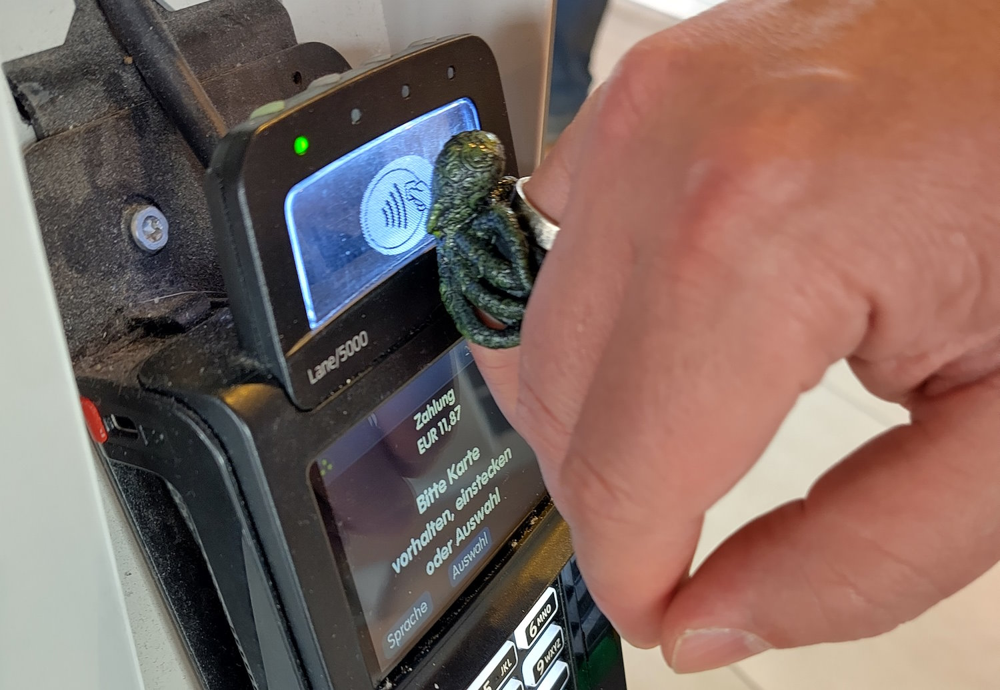

Maker Media GmbH

***

# Payment-Ring im Eigenbau

**Bezahlen praktisch im Vorbeigehen, ohne den Geldbeutel zu zücken – NFC-Chips, die etwa in Uhren, Armbänder oder Ringen eingebettet sind, machen es möglich. Wer solche Bezahl-Gegenstände selber baut, kann sie frei nach den eigenen Wünschen gestalten und kommt deutlich günstiger weg.**

Hier gibt es das [OpenSCAD-Skript](./src/Basisring.scad) für den universellen Basisring, der an die eigene Fingergröße angepasst werden kann.

Der vollständige Artikel zum Projekt steht in der **[Make-Ausgabe 3/24](https://www.heise.de/select/make/2024/3/2406816333194677299)** oder auf **[heise+](https://heise.de/-9712546)**.
